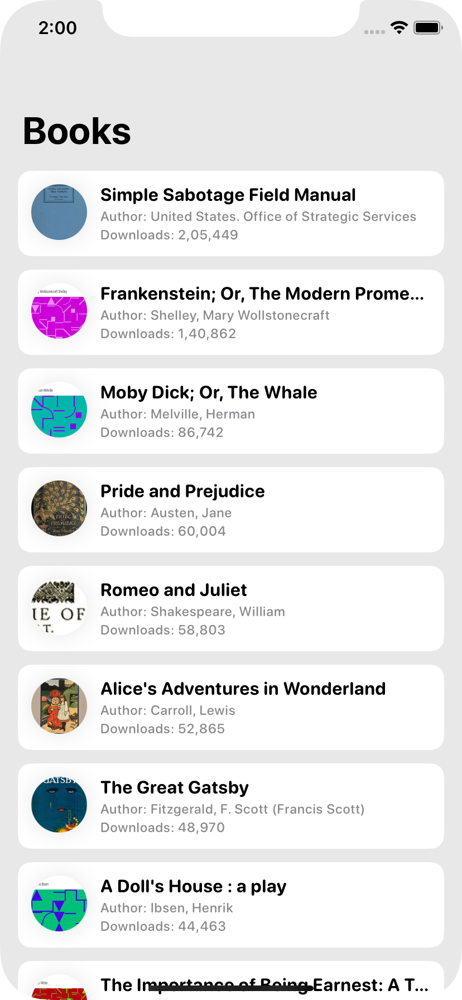
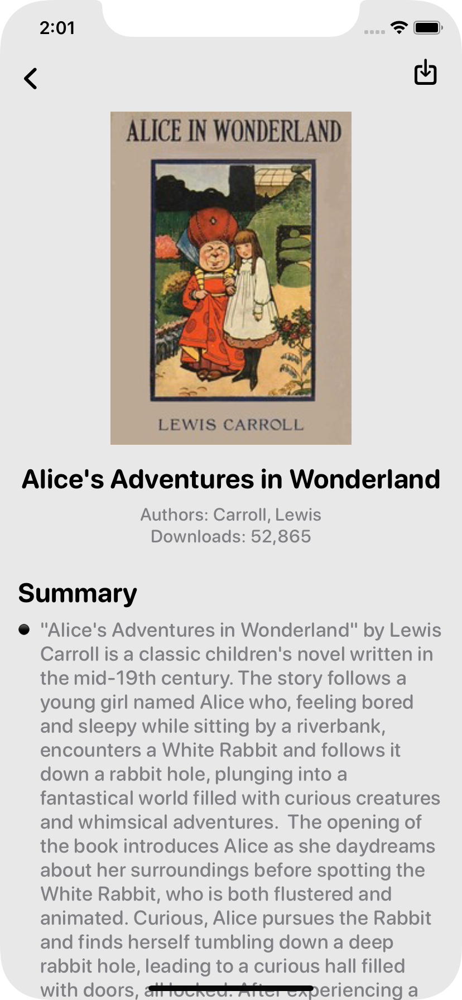

# BookVault

**BookVault** is a clean and simple iOS application that allows users to browse and view books sourced from the [Gutendex API](https://gutendex.com/). With a minimalist design and smooth SwiftUI experience, BookVault is perfect for quickly exploring literary classics.

---

## 📌 Features

- 📚 Fetch and display a list of books using REST API
- 🔍 View detailed information about selected books
- 📤 Share or download books in supported formats
- 🔄 Support for pagination to load more content

---

## 🛠 Technology Stack

- **Language:** Swift
- **UI Framework:** SwiftUI
- **Architecture:** VIPER
- **Networking:** `Alamofire` with async/await

---

## 📱 Minimum Deployment Target

- iOS 16.0

---

## 🔧 Tools

- Xcode 15
- Swift Package Manager

---

## 📸 Screenshots
<p float="left">


</p>

---

## 🚀 Getting Started

1. [Install Xcode](https://developer.apple.com/xcode/)
2. Clone this repository:
   ```bash
   git clone https://github.com/your-username/BookVault.git
